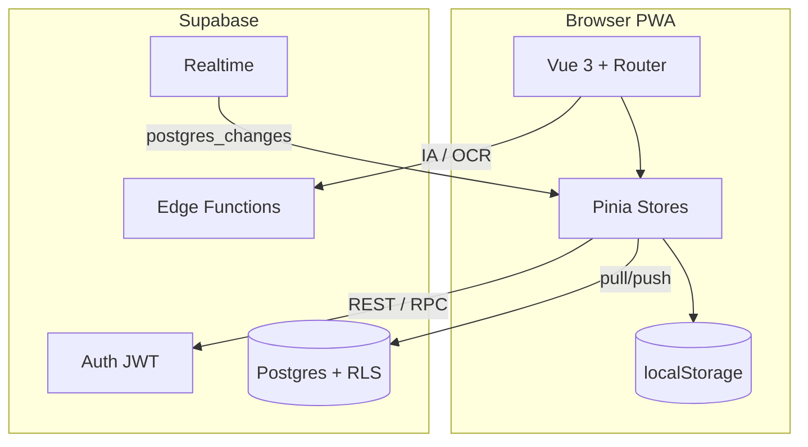

# Arquitetura

## Visão geral



## Camadas frontend

| Camada | Responsabilidade |
|--------|------------------|
| `src/views/*` | Páginas e fluxos de UI |
| `src/components/*` | Componentes reutilizáveis |
| `src/stores/finance.js` | Estado financeiro único (SSOT local) |
| `src/stores/family-sync.js` | Sync nuvem + Realtime |
| `src/stores/auth.js` | Sessão Supabase |
| `src/api/family-supabase.js` | Chamadas RPC/tabelas família |
| `src/utils/*` | Maturidade, compras IA, consolidação, família |
| `src/lib/supabase-client.js` | Inicialização do cliente |

## Fluxo de persistência local

1. `finance.loadState()` lê `localStorage` na inicialização.
2. Qualquer mutação chama `saveState()`.
3. `saveState()` grava JSON e agenda `familySync.schedulePush()` (debounce 1,5s), exceto se `skipCloudPush: true` ou `applyingRemote`.

## Fluxo de sincronização nuvem

1. Após login, `App.vue` chama `familySync.bootstrap()`.
2. `fetchMyMembership()` verifica se o usuário pertence a uma família.
3. `pullAndMergeState()` baixa `finance_states.data` se remoto for mais recente.
4. `subscribeRealtime()` escuta `UPDATE`/`INSERT` na linha da família.
5. Evento remoto → `applyRemoteRow()` → atualiza Pinia + localStorage **sem** push (flag `applyingRemote`).
6. Edição local → `pushNow()` envia JSON completo do estado.

## Modelo de dados local (resumo)

O objeto em `finance.state` inclui:

- `incomes`, `expenses`, `wishlist`, `priorityQueue`
- `financialAccounts`, `creditCards`, `benefitWallets`, `recurringIncomes`, `internalTransfers`
- `family`, `familyMembers`, `familyInvites`, `sharedDebts`, `sharedGoals`, `settlements`, `auditLog`
- `settings` (mês/ano, tema, maturidade, `lastRemoteSyncAt`, etc.)

Migrações incrementais rodam em `loadState()` via helpers (`family-migrate`, `financial-structure-migrate`).

## Rotas principais

Definidas em `src/router/index.js`:

- Rotas públicas: `/login`
- Rotas autenticadas: layout com `Sidebar` + `Topbar`
- Guard de auth redireciona para login se sem sessão

## Edge Functions

| Função | Uso |
|--------|-----|
| `ai-assistant` | Assistente financeiro |
| `receipt-ocr` | Leitura de notas |
| `chat` | Chat genérico compartilhado |

Secrets nunca no frontend.

## Decisões de design

- **Estado monolítico JSON** em `finance_states`: simples para família pequena; troca futura por tabelas normalizadas se escalar.
- **Last-write-wins** por timestamp: adequado para 2–5 membros com baixa contenção.
- **Realtime** apenas em `finance_states`: membros/convites atualizam via pull no bootstrap ou ações explícitas.

## Arquivos críticos para manutenção

```
src/stores/finance.js
src/stores/family-sync.js
src/api/family-supabase.js
src/lib/supabase-client.js
supabase/migrations/
```
